# Введение

В данной работе ставится задача изучить показатели динамики заболеваемости 
Covid19 в России и рассмотреть качественный пример парного развития динамики 
заболеваемости Covid19 в двух странах с точки зрения моделей взаимодействия, 
построенных на основе систем дифференциальных уравнений.

Ранее был получен значительный класс результатов, относящийся к 
исследованию динамики развития природных систем на основе классических 
дифференциальных моделей. Среди таких моделей широко известны модель Форрестера,
модель Гомперца, модель линейного убывания темпов. Подобно любой другой модели 
развития популяций, динамика численности заболевших Covid19 может отражать 
динамику распространения вируса как динамику популяции.

В ходе рассмотрения данной проблемы необходимо провести исследование медленных 
движений ряда данных динамики численности заболевших Covid19, оценить характерные 
значения почти-периодических компонент ряда, провести качественный анализ 
будущей тенденции заболеваемости.

За основу исследования трендовой составляющей ряда будет взята классическая 
дифференциальная постановка задачи моделирования динамики численности популяции 
на основе модели ограниченного роста Гомперца. 

При исследовании почти-периодических компонент необходимо обратиться к 
результатам исследований относительно применения функций, идентифицирующих 
почти-периодические зависимости, а именно: автокорреляционная функция и функция 
Альтера-Джонса.


# Теория методов анализа

## Автокорреляционная функция

Автокорреляционная функция — зависимость взаимосвязи между функцией (сигналом) и её сдвинутой копией от величины временного сдвига [1].
Для детерминированных сигналов автокорреляционная функция (АКФ) сигнала $f(t)$ определяется интегралом:

$$
  {\displaystyle \Psi (\tau )=\int _{-\infty }^{\infty }f(t)f^{*}(t-\tau )\mathrm {d} t}
$$
и показывает связь сигнала (функции $f(t)$) с копией самого себя, смещённого на величину $\tau$ . Звёздочка означает комплексное сопряжение.

## Функция Альтера-Джонса

Для выявления периодов, свободных по возможности от априорных предположений, используем подход, который опирается, прежде всего, на фундаментальное характеристическое свойство периода функции, состоящее в повторении значений функции через интервал изменения независимой переменной равный периоду

$$
  f(t + \tau) - f(t) = 0
$$

Вводится следующее определение почти–периодической функции: число $\tau$ называется $\epsilon$ – почти–периодом ($\epsilon$ – смещением) 
функции $f(t)$ $(- \infty < t < \infty)$, если для всех t выполняется неравенство

$$
  \left| f(t + \tau) - f(t) \right| < \epsilon
$$

Если $f(t)$ – периодическая функция и $\tau$ – ее период, то есть $f(t + \tau)$ = $f(t)$, то, очевидно, $\tau$ является также и почти–периодом для любого $\epsilon > 0$, точно так же, как и любое число вида $n \tau$ $(n = \pm1 , \pm 2,…)$.

Для дискретного случая, если $n$ - общее число отсчетов функции $f(t)$, заданной экспериментальными значениями, вводится следующая метрика для определения почти периодов:

$$
  a(\tau) = \frac{1}{n - \tau} \sum_{t = 1}^{n - \tau}  \left| f(t + \tau) - f(t) \right|.
$$

Эта функция называется сдвиговой или функцией Альтера-Джонса.

Система почти - периодов $\tau$ функции $f(t)$ может быть определена как совокупность локальных минимумов сдвиговой функции

$$
  \tau = arg min\left[ a(\tau) \right] , \tau_{min} < \tau < \tau_{max}
$$

Функция Альтера–Джонса определяет среднее расстояние по оси ординат между точками, расположенными на расстоянии τ по оси абсцисс друг от друга.

## Модель Гомперца

Дифференциальное уравнение модели Гомперца

$$
 \frac{dy}{dt} = A e^{-kt} \cdot y
$$

Из исходного уравнения модели Гомперца получается следующая анаморфоза:

$$
  ln \left( \frac{1}{y} \frac{dy}{dt} \right) = ln \left( A \right) - kt
$$

Построение данных, соответствующих модели Гомперца, даёт спрямление в координатах $ln \left( \frac{1}{y} \frac{dy}{dt} \right) \sim t$. Это задаёт алгоритм оп-
ределения параметров уравнения Гомперца. В этом случае по линейному участку зависимости определяем параметр k, который представлен углом наклона прямой к оси абсцисс.

В точке перегиба 

$$
   \frac{1}{y} \frac{dy}{dt} = k \text{      } или \text{      } ln \left( \frac{1}{y} \frac{dy}{dt} \right)  = ln \left( k \right) 
$$


Т.е вычисляем логарифм угла наклона и откладываем полученное значение на оси ординат как линию постоянного уровня. Пересечение этой линии с исходной прямой определяет время достижения точки перегиба на кривой, характеризующей суммарное количество добытого к данному моменту ресурса. Это позволяет определить положение точки перегиба.

Следующая анаморфоза получается из уравнения


## Дифференциальная модель взаимодействия процессов

Если динамическая система представлена двумя процессами во времени $\left( x(t), y(t) \right)$, тогда модель взаимодействия динамики развития процессов во времени описывается следующей дифференциальной системой второго порядка:

$$
  \frac{dx}{dt} = x \cdot \left(\beta_{1} - \alpha_{1} \cdot y \right)
$$

$$
  \frac{dy}{dt} = y \cdot \left(\beta_{2} - \alpha_{2} \cdot x \right)
$$

Данная система иллюстрирует в своём частном случае при $\beta_{2} < 0$ и $\alpha_{2} < 0$ классическую модель "хищник-жертва".

Для реальных процессов, имея значения рядов, можно идентифицировать параметры данной системы на основе анаморфоз вида:

$$
  \frac{dx}{x \cdot dt} = \beta_{1} - \alpha_{1} \cdot y
$$

$$
  \frac{dy}{y \cdot dt} = \beta_{2} - \alpha_{2} \cdot x.
$$

Тогда, линейная модель на спрямляющемся участке графика будет содержать в себе параметры динамической системы, показаной выше.

# Анализ динамики заболеваний Covid19 в России


## Графическое предобследование

Проиллюстрируем динамику заболеваемости в России с помощью графика в следующих координатах: по оси абсцисс отложим дни с момента "2021-01-22", а по оси ординат значения заболеваний в России каждый день суммарно по всем регионам. Также оранжевыми линиями отобразим пики на графике, а именно локальные максимумы "волн" заражений. Между максимумами отложим равные интервалы в 114 дней и получим локальные минимумы "волн" заражений.

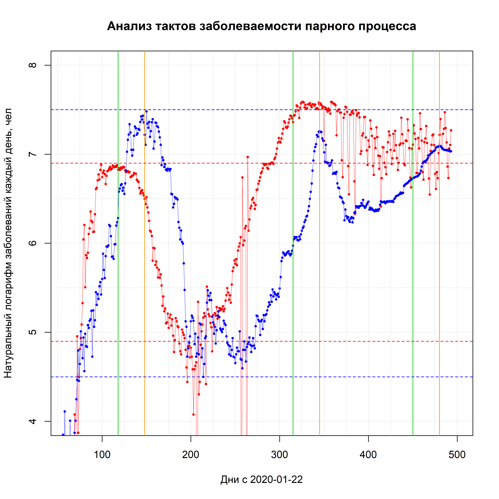{width=800 height=800}

При помощи графического предобследования было определено характерное время смены тенденции процесса, а именно $T = 114$ дней для России по текущим данным. Определены даты пиковых заражений и даты локальных минимумов.

  1. Первый максимум 2020-05-10: 1.1012\times 10^{4}.
  2. Первый минимум 2020-09-01: 4670.
  3. Второй максимум: 2020-12-24: 2.9499\times 10^{4}.
  4. Второй минимум: 2021-04-17: 9201

## Анализ быстрых движений

Анализ быстрых движений подразумевает исследование сезонной компоненты относительно трендовой составляющей динамики заболеваемости. По построенному графику в разделе графического предобследования можно сказать о том, что в данной системе присутствует очень сильно выраженный тренд и очень маленькие, по сравнению с трендовыми значениями, колебательные составляющие.

Для того чтобы охарактеризовать колебательные движения относительно тренда необходимо произвести исследование динамики относительно тренда на почти-периодические компоненты, то есть найти характерные времена почти-периода. Для того чтобы это сделать, сперва необходимо удалить тренд из ряда. Это можно сделать либо простым численным дифференцированием, либо специальными функциями исключения тренда.

Функция исключения тренда:

$$
  R(t) = ln \left( \frac{y_{t - 1} * y_{t + 1}}{y_{t}^2} \right).
$$

Построим график функции исключения тренда исходной динамики:

{width=800 height=800}

К данному ряду применим автокорреляционную функцию и функцию Альтера-Джонса для поиска характерного времени $\tau$ - времени почти-периода малых колебаний относительно тренда:

{width=800 height=800}


{width=800 height=800}

На основе функции Альтера-Джонса и автокорреляционной фунции нами было получено характерное время почти-периода $\tau = 7$ дней, или неделя.

## Анализ медленных движений ряда

Предварительно рассмотрим два повторяющихся пика на графике динамики численности заболевших, совместив их максимумы "друг под другом", таким образом мы сможем оценить совпадающие критические уровни в развитии системы на данных интервалах и оценить схожесть тендеции развития на каждой из "волн" заболеваемости. Для совмещения значений двух пиков отнормируем больший пик к меньшему делением значений на максимальное значение большего ряда и умножим их на максимальное значение меньшего. По пропорциям получим исходную форму графика, что позволит на уровне относительных величин сравнивать формы кривых динамики развития системы.

{width=800 height=800}

Как видим исходя из графика, значения пиков совмещены вместе со значениями в 1.44 раза меньше по сравнению с наибольшим значением волны. Это является прямым доказательством связи данных участков друг с другом, а также показывает возможное проявление модели Гомперца в качестве основной модели развития системы во времени, то есть трендовой модели.
Время между максимальным значением и значением, меньшим в 1.44 раза lag = 36 дней.

## Исследование тренда на основе модели Гомперца

Модель Гомперца - дифференциальная модель ограниченного роста, отражающая по-сути развитие популяций, в основе которой лежит понимание ограничения на рост системы. Такая модель является наиболее точной среди остальных моделей развития популяций, ввиду несиметричности теоретической кривой решения. Началу процесса характерен резкий подъём, а после точки максимума скорости развития системы происходит уменьшение темпов роста с менее быстрой скоростью. Такая модель наиболее удобна с точки зрения аппроксимации реальных данных по причине наибольшей распространённости процессов с похожей динамикой.

Рассмотрим получение параметров модели Гомперца для реальных данных на основе спрямления в функциональных координатах. Теоретически модель Гомперца была описана в соответствующем разделе, также и описаны методы получения параметров модели.

Для первого интервала в 228 дней от начала процесса построим график в функциональных координатах анаморфозы модели Гомперца.

$$
  ln \left( \frac{1}{y} \frac{dy}{dt} \right) \sim t
$$


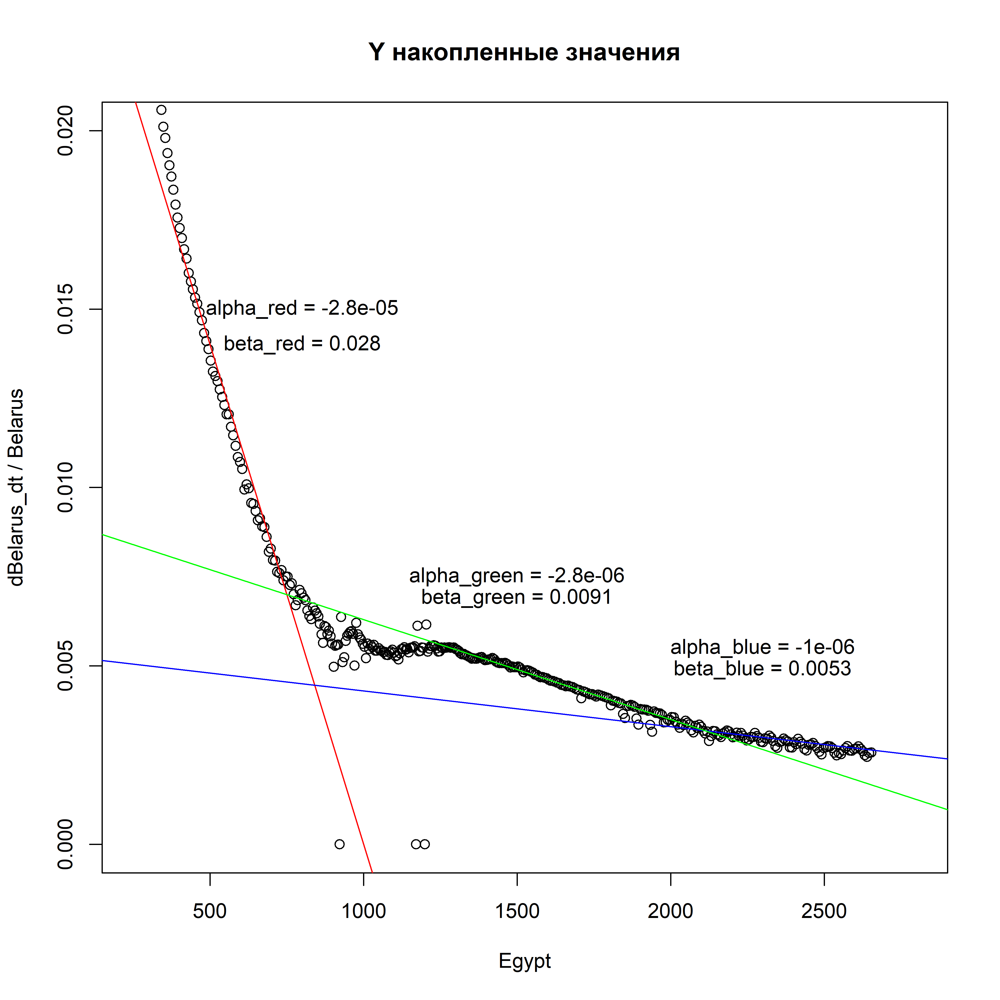{width=800 height=800}

На графике в координатах анаморфозы Гомерца видим спрямление участка данных. Данный факт говорит о принадлежности данного участка дифференциальной модели Гомперца по определению функциональных координат, в которых построен график. 

Параметры прямой в функциональных координатах: ln(-k) = -3.41 ; -k = -0.033 ; b = 0.67.

Вернув данные параметры в исходное уравнение получим оценку тренда по модели Гомперца. Отобразим теоретическую модельную кривую и исходные данные на графике.

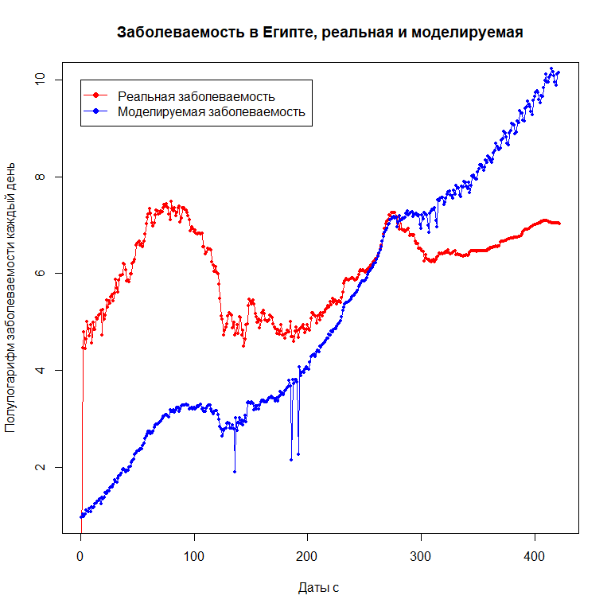{width=800 height=800}

На графике видно, что первые 160 значений ряда данных подчинялись с определённой точностью полученной теоретической зависимости. В точке $t = 160$ модельная кривая и реальные данные расходятся в значениях в большую сторону у реальных данных, что может символизировать о начале переходного процесса перед реализацией новой волны заражений.

Отобразим полученную теоретическую Гомперцевую кривую на всей области определения исходного ряда данных.

{width=800 height=800}

В рамках анализа исключим из рассмотрения полученную теоретическую зависимость по модели Гомперца и оценим возможность реализации новой модели на второй "волне" заражений. Отобразим на графике занчения после исключения первой теоретической Гомперцевой кривой. Полученный ряд имеет незначительные флуктуации вначале из-за точности трендовой аппроксимации, а также имеет только один ярко выраженный пик на диапазоне второй волны.

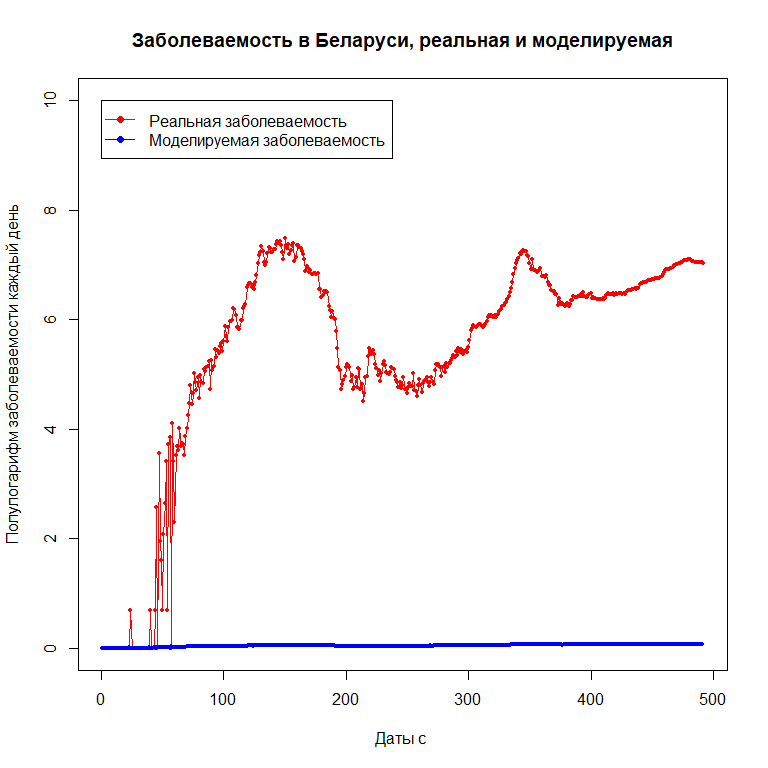{width=800 height=800}

Попробуем для данного ряда оценить параметры модели Гомперца тем же способом через функциональные координаты - анаморфозу модели Гомперца.

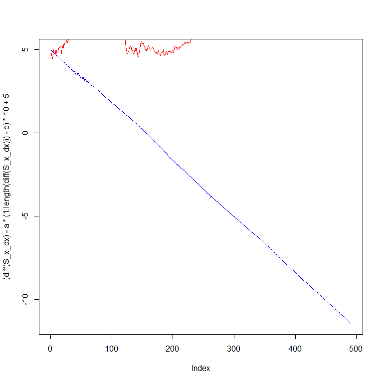{width=800 height=800}

Полученные параметры -k = -0.021 ; b = 2.8 вернём обратно в модель Гомперца для построения теоретической кривой зависимости относительно реальных данных. Покажем на графике истинные значения заболеваемости без первой "волны" и теоретически полученную зависимость по дифференциальной модели.

{width=800 height=800}

На графике видим неоднозначную картину, что произошло ввиду большого количества значений до реализации модели. Вначале из-за флуктуаций, модель Гомперца вела себя похожим образом. Теоретическая зависимость своим правым скатом хорошо объяснила правый край реальных данных, который отвечает за современную динамику, чего не случилось с левым краем. Получаем идеальное объяснение при сдвиге теоретической кривой на 50 дней вперёд. Таким образом, точно показать зависимость по модели Гомперца для второй волны нам не удалось. Удалось показать поразительное объяснение кусочной зависимости ряда данных от времени прим помощи модели ограниченного роста. Как и с первой реализацией модели, получилось что через некоторое время модель теряет свою объясняющую силу и срывается вниз, когда реальная зависимость идёт в рост.

Для точной перепроверки стоит проверить ещё вторую волну отдельно на своём интервале на соответствие модели Гомперца.

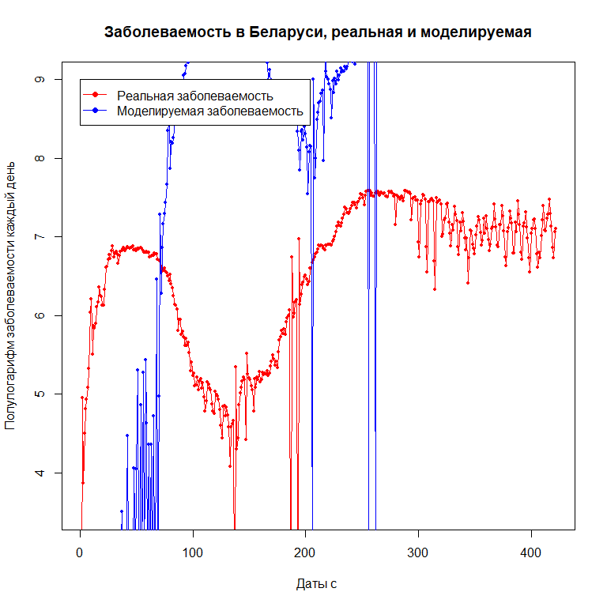{width=800 height=800}

{width=800 height=800}

{width=800 height=800}


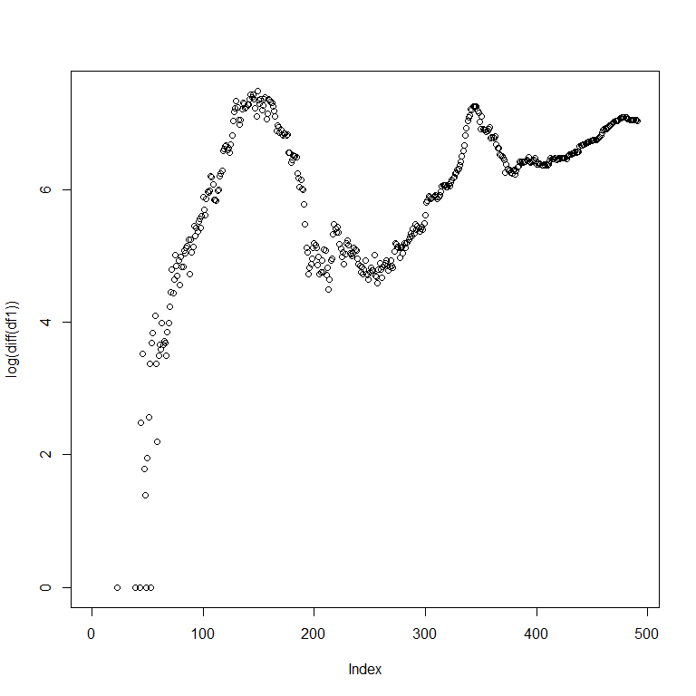<!-- -->


# Анализ парных движений на фазовых плоскостях

## Предобследование парной динамики заболеваемости

Рассмотрим динамику заболеваемости Covid19 в двух странах, построим их графики заболеваемости во времени, а также фазовую плоскость. 

На графике динамики двух стран отложим по оси ординат натуральный логарифм ежедневных приростов больных Covid19, по оси абсцисс номер дня с момента начала мирового распространения 2020-01-22. По данному графику мы сможем визуально оценить модель взаимодействия двух процессов на качественном уровне.

В качестве примера возьмём две страны с открытыми туристическими границами - Египет и Беларусь.


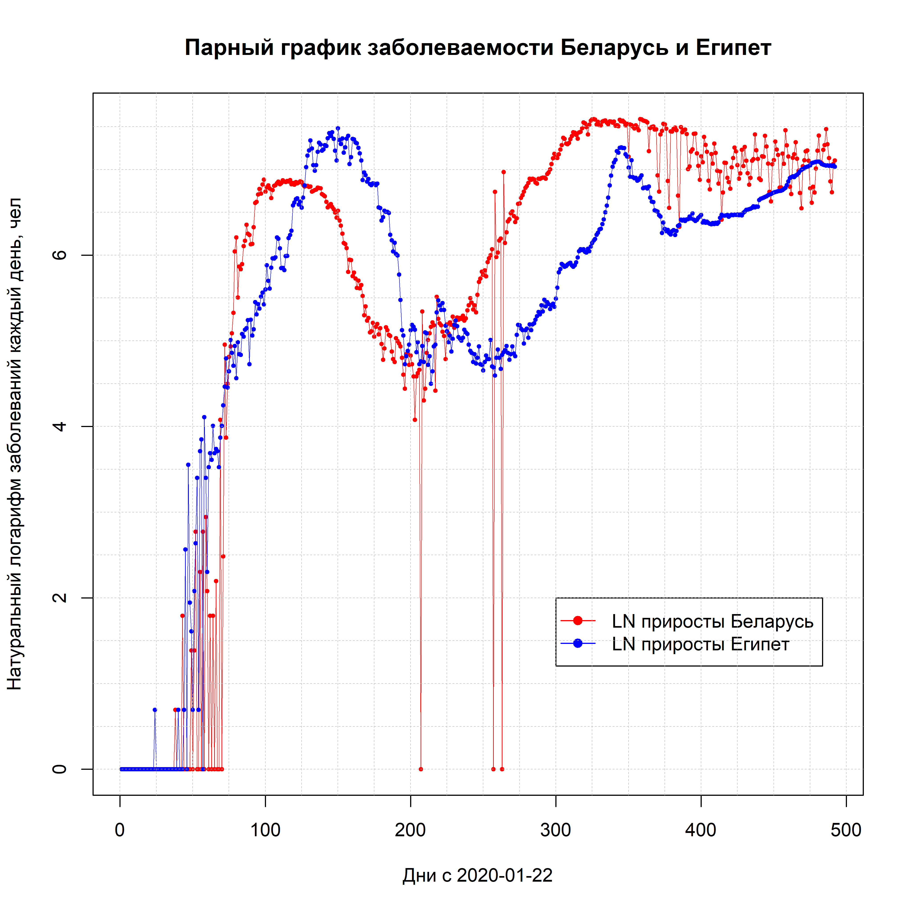<!-- -->

График парной динамики показывает нам, что уровень заболеваемости, длительность тактов вспышек заболеваемости в двух странах находятся примерно на одном уровне. На последнем временном отрезке в 350 дней от начала измерений и до настоящего времени видим на графике динамики заболеваемости в Беларуси появившуюся недельную сезонность - коррекцию на некоторый момент времени, являющуюся ответной реакцией процесса на некоторые структурные изменения механизма измерения числа заболевших. Такое качественное изменение характера динамики процесса может существенно повлиять на дальнейший анализ данного процесса. 

На графике динамики заболеваемости в Египте видим на момент 28.05.2021 начало спада и точку перелома приростов заболевших Covid19, что означает возможное прохождение точки максимума заражений во время 3 волны массовых заражений.

Оценим длительность тактов переходных процессов спада и роста количества заболевших относительно точек максимума заражений на графике заболеваемости в Египте.

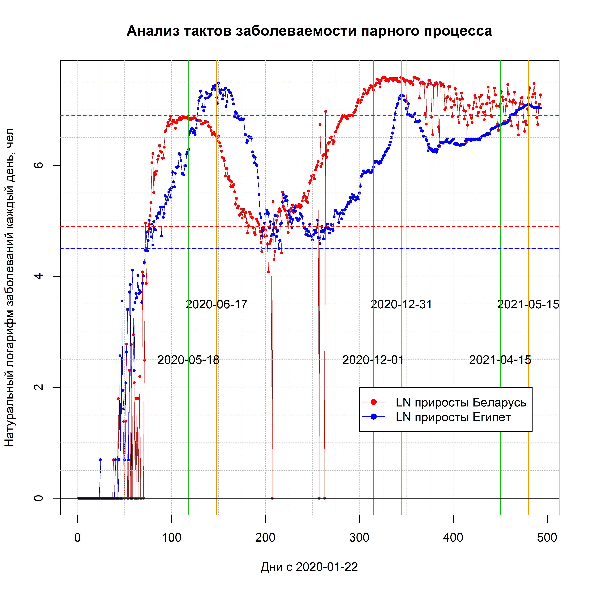<!-- -->

Из расставленных точек максимума заболеваемости на графиках по Беларуси и Египту видим что в начале процесса существовал некоторый почти-периодический процесс с обеих сторон с лагом между процессами в 30 дней. Также видим что из-за структурного изменения процесса измерения числа заболевших в Беларуси такого эффекта не наблюдалось в последнюю волну. 

Для завершения исследования парного развития процесса заболеваемости в двух странах необходимо провести анализ динамики на фазовой плоскости динамик процессов. Произведём построение графика с осью ординат - заболеваемостью в Египте, и осью абсцисс - заболеваемостью в Беларуси:

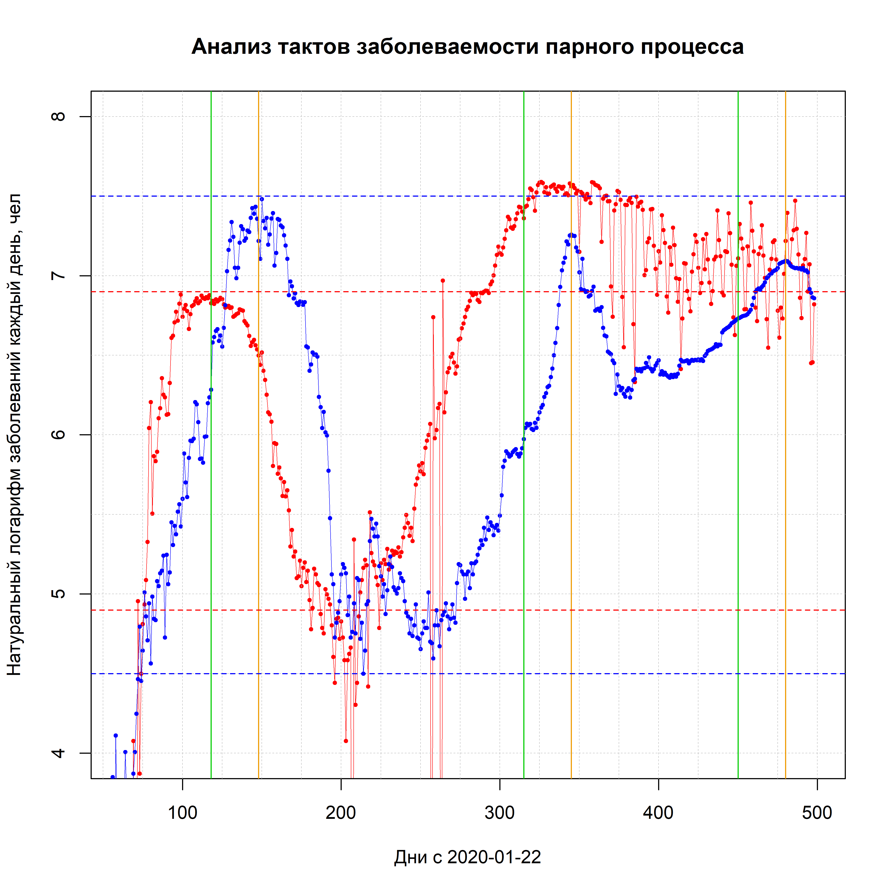<!-- -->

На фазовой плоскости динамики двух процессов наблюдаем замкнутый контур завершённого полного такта взаимодействия двух процессов, после которого последовало продолжение огибающего контура в правой части графика. Наблюдаем такую же структурную навивку с отклонениями недельных колебаний в сторону исходной эллипсовой кривой такта взаимодействия двух процессов (выделено синими штрихами).

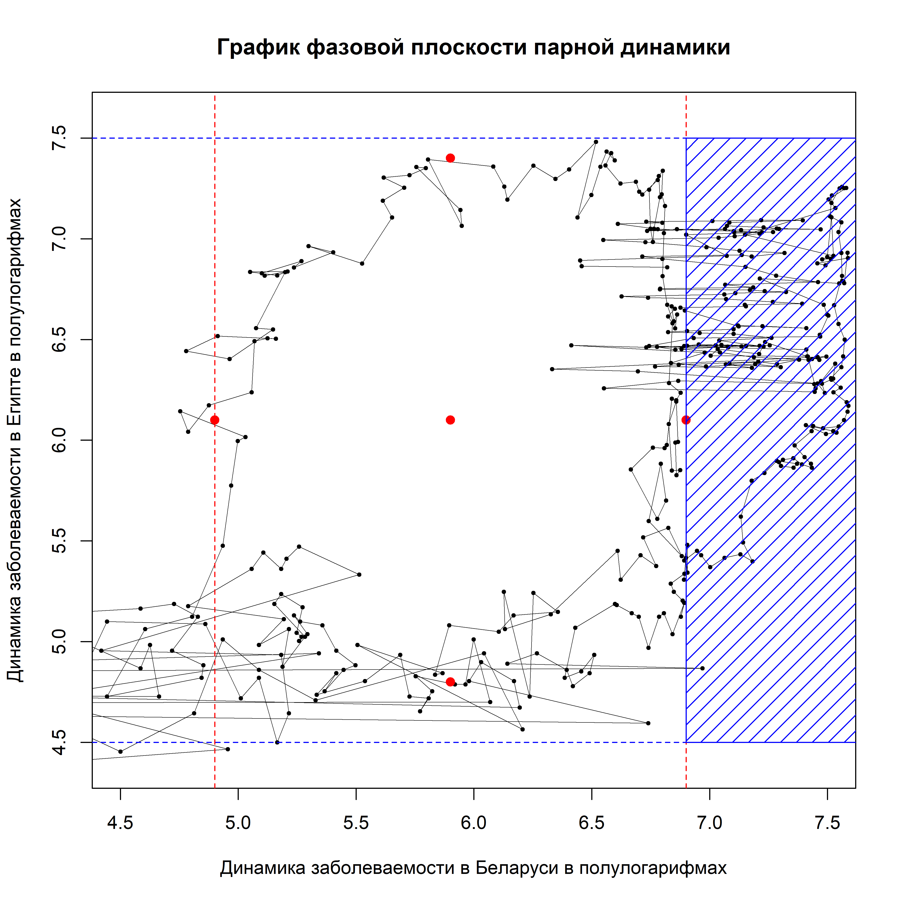<!-- -->

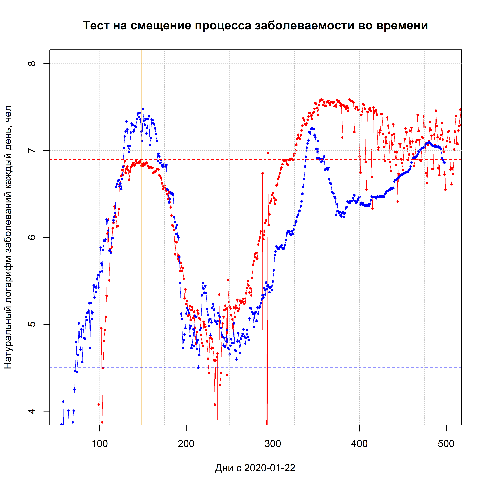<!-- -->

Хорошим тестом для проверки как лага по времени отставания двух процессов друг относительно друга так и зависимости между ними с точки зрения системы дифференциальных уравнений может оказаться смещение на лаг отставания процесса друг относительно друга в сторону постановки "процесса под процесс" так, чтобы такты двух процессов оказались синхронизированными. В таком случае при подобном смещении на графике фазовой плоскости будут образовываться прямолинейные зависимости, обозначающие высокую степень корреляции двух процессов во времени.

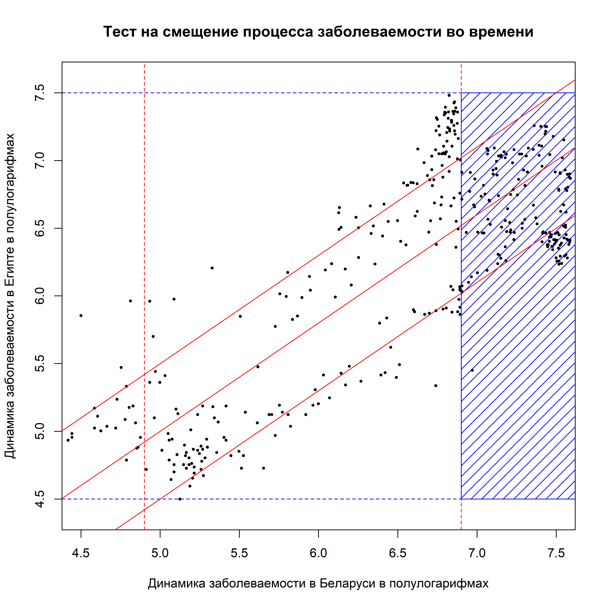<!-- -->

<!-- -->

Таким образом, так же на качественном уровне нами было получено заключение о высокой корреляции процессов после смещения их друг относительно друга на такт запаздывания.

## Постановка системы дифференциальных уравнений процесса взаимодействия

Предположим, что данное взаимодействие двух процессов может быть описано с помощью системы дифференциальных уравнений с логистической зависимостью:

$$
  \frac{dx}{dt} = x \cdot \left(\beta_{1} - \alpha_{1} \cdot y \right)
$$

$$
  \frac{dy}{dt} = y \cdot \left(\beta_{2} - \alpha_{2} \cdot x \right)
$$
Данная система иллюстрирует в своём частном случае при $\beta_{2} < 0$ и $\alpha_{2} < 0$ классическую модель "хищник-жертва".

**Исследование системы первого приближения.** По формуле Тейлора для системы функций, найдем вид системы уравнения в окрестности точки покоя по первому приближению. Вид приближения:

$$
  \frac{dx}{dt} = P(x,y) \approx \frac{\partial P(x_{0}, y_{0})}{\partial x} \cdot (x - x_{0}) + \frac{\partial P(x_{0}, y_{0})}{\partial y} \cdot (y - y_{0})
$$

$$
  \frac{dy}{dt} = Q(x,y) \approx \frac{\partial Q(x_{0}, y_{0})}{\partial x} \cdot (x - x_{0}) + \frac{\partial Q(x_{0}, y_{0})}{\partial y} \cdot (y - y_{0}),
$$
где $P(x, y)$ и $Q(x, y)$ - система функций дифференциальной системы, пара $(x_{0}, y_{0})$ - точка покоя системы дифференциальных уравнений или точка установленного стационарного режима для ассимптотически устойчивых и просто устойчивых систем дифференциальных уравнений.

**Нахождение точки покоя системы дифференциальных уравнений.** Поставим в систему уравнений в левые части нули, обозначающие ноль приращений функций $x(t)$ и $y(t)$ или точку стационарного режима динамической системы:

$$
  0 = x_{0} \cdot \left(\beta_{1} - \alpha_{1} \cdot y_{0} \right)
$$

$$
  0 = y_{0} \cdot \left(\beta_{2} - \alpha_{2} \cdot x_{0} \right).
$$

Тогда решением данной системы $(x_{0}, y_{0})$ будет являться следующая пара значений:

$$
  x_{0} = \frac{\beta_{2}}{\alpha_{2}} 
$$

$$
  y_{0} = \frac{\beta_{1}}{\alpha_{1}} .
$$
Подставим данную пару значений в уравнения системы по первому приближению, получим:

$$
  \frac{dx}{dt} \approx \left(\beta_{1} - \alpha_{1} \cdot y_{0} \right) \cdot (x - x_{0}) - \alpha_{1} \cdot x_{0} \cdot (y - y_{0})
$$

$$
  \frac{dy}{dt} 
  \approx - \alpha_{2} \cdot y_{0} \cdot (x - x_{0}) + \left(\beta_{2} - \alpha_{2} \cdot x_{0} \right) \cdot (y - y_{0})
$$

Тогда в первом приближении система уравнений будет выглядеть следующим образом:

$$
  \frac{dx}{dt} \approx \frac{\beta_{1} \cdot \beta_{2}}{\alpha_{2}} - \alpha_{1} \cdot \frac{\beta_{2}}{\alpha_{2}} \cdot y 
$$

$$
  \frac{dy}{dt} 
  \approx \frac{\beta_{1} \cdot \beta_{2}}{\alpha_{1}} - \alpha_{2} \cdot \frac{\beta_{1}}{\alpha_{1}} \cdot x.
$$
Запишем матрицу $A$ системы уравнений в смещениях $\left( \frac{dX}{dt}, \frac{dY}{dt} \right)$ относительно точки $(0, 0)$, а также определитель данной матрицы:

$$
 A = \begin{pmatrix}
0 &  - \alpha_{1} \cdot \frac{\beta_{2}}{\alpha_{2}}\\
- \alpha_{2} \cdot \frac{\beta_{1}}{\alpha_{1}} & 0
\end{pmatrix}
$$
$$
 det(A) = - (- \alpha_{1} \cdot \frac{\beta_{2}}{\alpha_{2}}) \cdot (- \alpha_{2} \cdot \frac{\beta_{1}}{\alpha_{1}}) = -\beta_{1} \beta_{2}.
$$ 

**Характеристическое уравнение системы первого приближения.** Для системы дифференциальных уравнений в первом приближении запишем характеристическое уравнение для определения характеров возможных точек покоя системы в зависимости от значений параметров системы. Характеристическое уравнение выглядит следующим образом:

$$
  \left| A - \lambda \cdot I  \right| = 0, 
$$

где $A$ - матрица системы уравнений, $\lambda$ - собственные значения матрицы $A$, $I$ - единичная матрица.

Найдем $\lambda$ из данного уравнения:

$$
 \left| A - \lambda \cdot I  \right| = \begin{vmatrix}
-\lambda &  - \alpha_{1} \cdot \frac{\beta_{2}}{\alpha_{2}}\\
- \alpha_{2} \cdot \frac{\beta_{1}}{\alpha_{1}} & -\lambda
\end{vmatrix} = 0
$$

$$
  \lambda^{2} -\beta_{1} \beta_{2} = 0
$$

$$
\lambda_{1, 2} = \pm \sqrt{\beta_{1} \cdot \beta_{2}}.
$$


Из представленного равенства закономерно получаем, что: 

  1. $\lambda_{1, 2} \in \mathbb{R}$ в случае если $(\beta_{1} > 0 \cap \beta_{2} > 0) \cup (\beta_{1} < 0 \cap \beta_{2} < 0)$
  2. $\lambda_{1, 2} \in \mathbb{С}$, если $(\beta_{1} > 0 \cap \beta_{2} < 0) \cup (\beta_{1} < 0 \cap \beta_{2} > 0)$.

В случае, если $\lambda_{1, 2} \in \mathbb{R}$, то $\lambda_{1} > 0$ и $\lambda_{2} < 0$ - точка $(x_0, y_0)$ - седлоузел на графике фазовой плоскости.

В случае, если $\lambda_{1, 2} \in \mathbb{С}$, то $\lambda_{1, 2} = \pm i \cdot \sqrt{ \left| \beta_{1} \right| \cdot \left| \beta_{2} \right|}$ - точка $(x_0, y_0)$ - центр на графике фазовой плоскости.

## Моделирование системы дифференциальных уравнений


<!-- -->


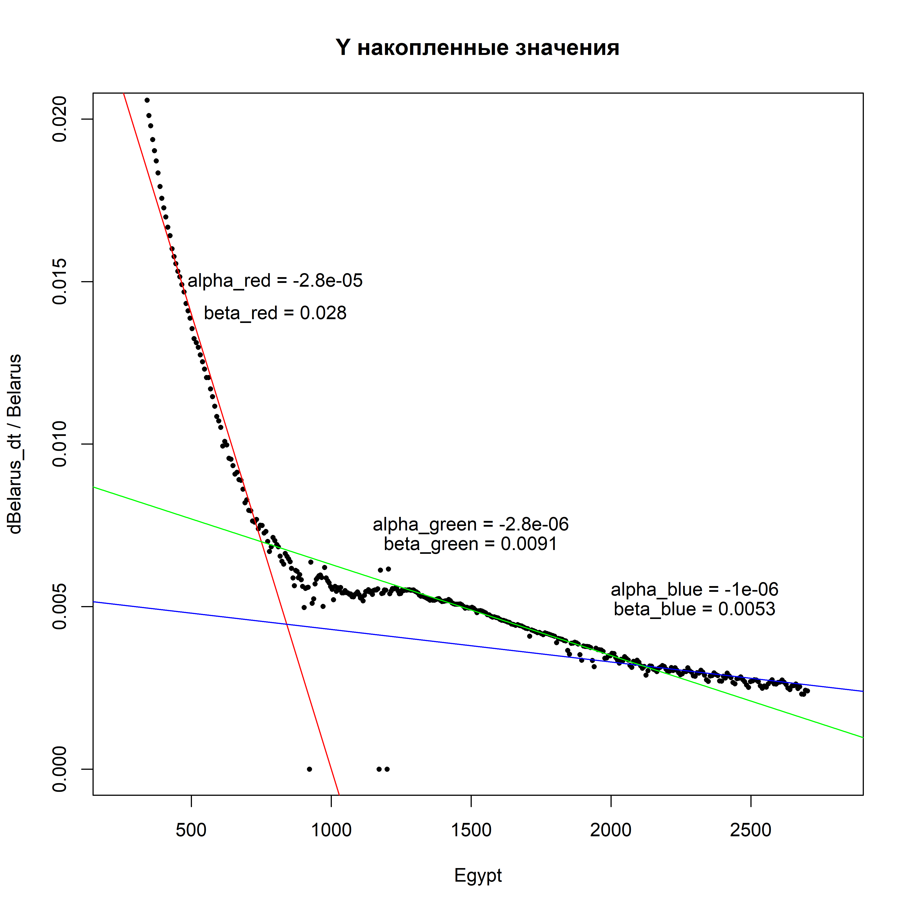<!-- -->


<!-- -->


```r
parameters <- c(b1 = -1.5, a1 = -0.05, b2 = 2.5, a2 = 0.07)
ini_state <- c(x1 = -1.1, x2 = -1.4)
times <- seq(0, 200, 0.1)
out <- ode(func = LV, y = ini_state, parms = parameters, times = times)

ini_state2 <- c(x1 = 1.1, x2 = 1.4)
out2 <- ode(func = LV, y = ini_state2, parms = parameters, times = times)

ini_state3 <- c(x1 = 1.1, x2 = 2.4)
out3 <- ode(func = LV, y = ini_state3, parms = parameters, times = times)

ini_state4 <- c(x1 = 1.1, x2 = -1.4)
out4 <- ode(func = LV, y = ini_state4, parms = parameters, times = times)

ini_state5 <- c(x1 = 1.1, x2 = -2.4)
out5 <- ode(func = LV, y = ini_state5, parms = parameters, times = times)

ini_state6 <- c(x1 = -1.1, x2 = -1.9)
out6 <- ode(func = LV, y = ini_state6, parms = parameters, times = times)

plot(out[, 2], out[, 3], type = "l",
     ylim = c(-50, 250),
     xlim = c(-1, 10),
     main = "Седловая точка процесса",
     ylab = "y",
     xlab = "x")
lines(out2[, 2], out2[, 3])
lines(out3[, 2], out3[, 3])
lines(out4[, 2], out4[, 3])
lines(out5[, 2], out5[, 3])
lines(out6[, 2], out6[, 3])
points(x = c(ini_state[1], ini_state2[1], ini_state3[1], ini_state4[1], ini_state5[1], ini_state6[1]), 
       y = c(ini_state[2], ini_state2[2], ini_state3[2], ini_state4[2], ini_state5[2], ini_state6[2]), col = "red")
abline(h = seq(-1100, 1100, 50), col = "grey", lty = 2)
abline(v = seq(-1000, 1000, 0.25), col = "grey", lty = 2)
```

<!-- -->


## Определение параметров дифференциальной модели

Тогда, система анаморфоз для определения параметров данной системы взаимодействия выглядит следующим образом:

$$
  \frac{dx}{x \cdot dt} = \beta_{1} - \alpha_{1} \cdot y
$$

$$
  \frac{dy}{y \cdot dt} = \beta_{2} - \alpha_{2} \cdot x
$$

Алгоритм определения данных параметров выглядит следующим образом: 

  1. построить в спрямляющих функциональных координатах исходные зависимости,
  2. оценить параметры линейных участков данных процессов в спрямляющих координатах,
  3. сохранить параметры линейных моделей.


## Поиск модели системы дифференциального уравнения

Построим графики в спрямляющих координатах для поиска параметров модели взаимодействия двух процессов на основе модели линейной регрессии относительно участков спрямления модели:


<!-- -->


<!-- -->

 
**Модель "красной" линии**

$$
  \frac{dx}{x \cdot dt} = 0.028 + 2.8 * 10^{-5} \cdot y
$$

$$
  \frac{dy}{y \cdot dt} = 0.028 + 2.8 * 10^{-5} \cdot x
$$

**Модель "синей" линии**

$$
  \frac{dx}{x \cdot dt} = 0.0053 + 10^{-6} \cdot y
$$

$$
  \frac{dy}{y \cdot dt} = 0.0053 + 10^{-6} \cdot x
$$

**Модель "сине-зелёной" линии**

$$
  \frac{dx}{x \cdot dt} = 0.0053 + 10^{-6} \cdot y
$$

$$
  \frac{dy}{y \cdot dt} = 0.0091 + 2.8 \cdot 10^{-6} \cdot x
$$

**Модель "красно-зелёной" линии**

$$
  \frac{dx}{x \cdot dt} = 0.028 + 2.8 \cdot 10^{-5} \cdot y
$$

$$
  \frac{dy}{y \cdot dt} = 0.0091 + 2.8 \cdot 10^{-6} \cdot x
$$

В качестве главной модели выберем последнюю (**Модель "красно-зелёной" линии**), по причине того, что она занимает большую часть зависимости. Получим для данной модели системы уравнений качественные кривые и фазовую плоскость. В качестве динамики X и Y выберем исходные данные накопленной заболеваемости в полулогарифмическом масштабе. Полученные оценки модели могут быть применены также к любым другим модельным данным.


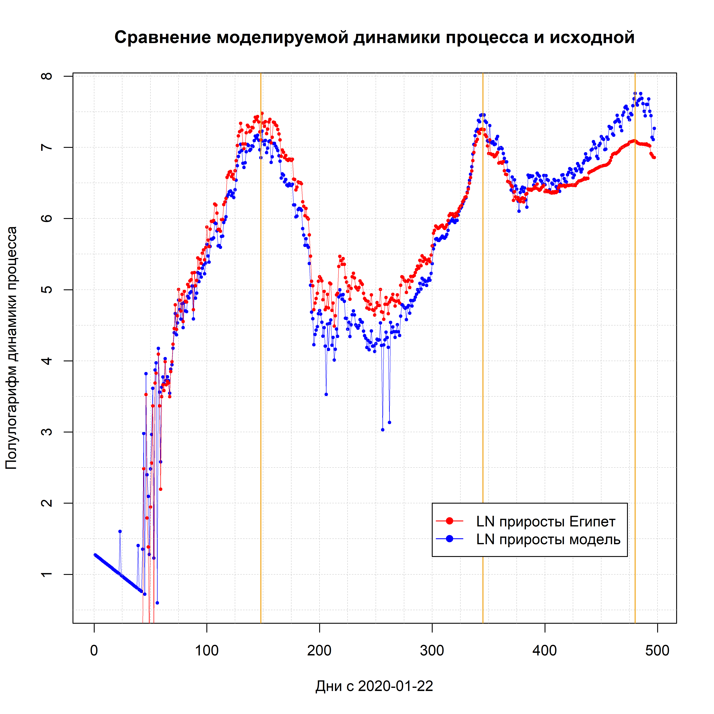{width=1000 height=1000}


{width=1000 height=1000}


<!-- -->


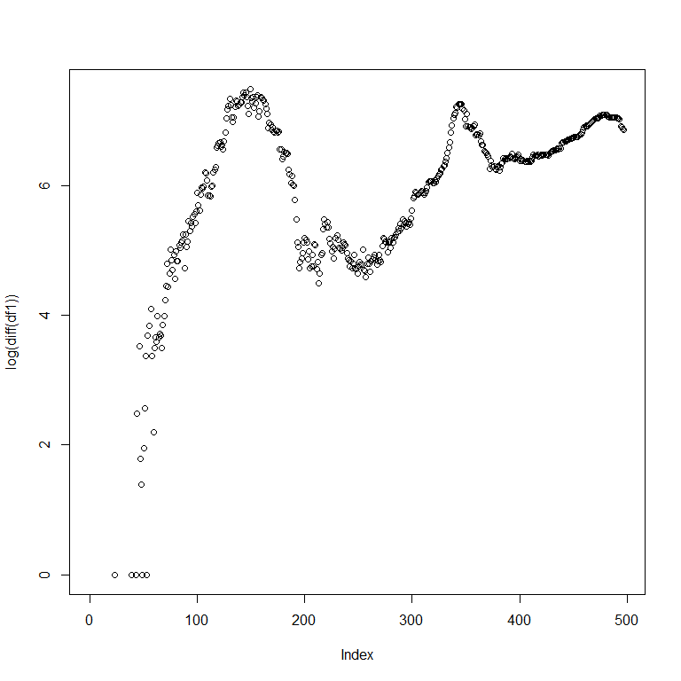<!-- -->


<!-- -->

<!-- -->

<!-- -->

<!-- -->


# Список литературы

1.  Charles Therrien, Murali Tummala. Probability and Random Processes for Electrical and Computer Engineers. — CRC Press, 2012. — P. 287
