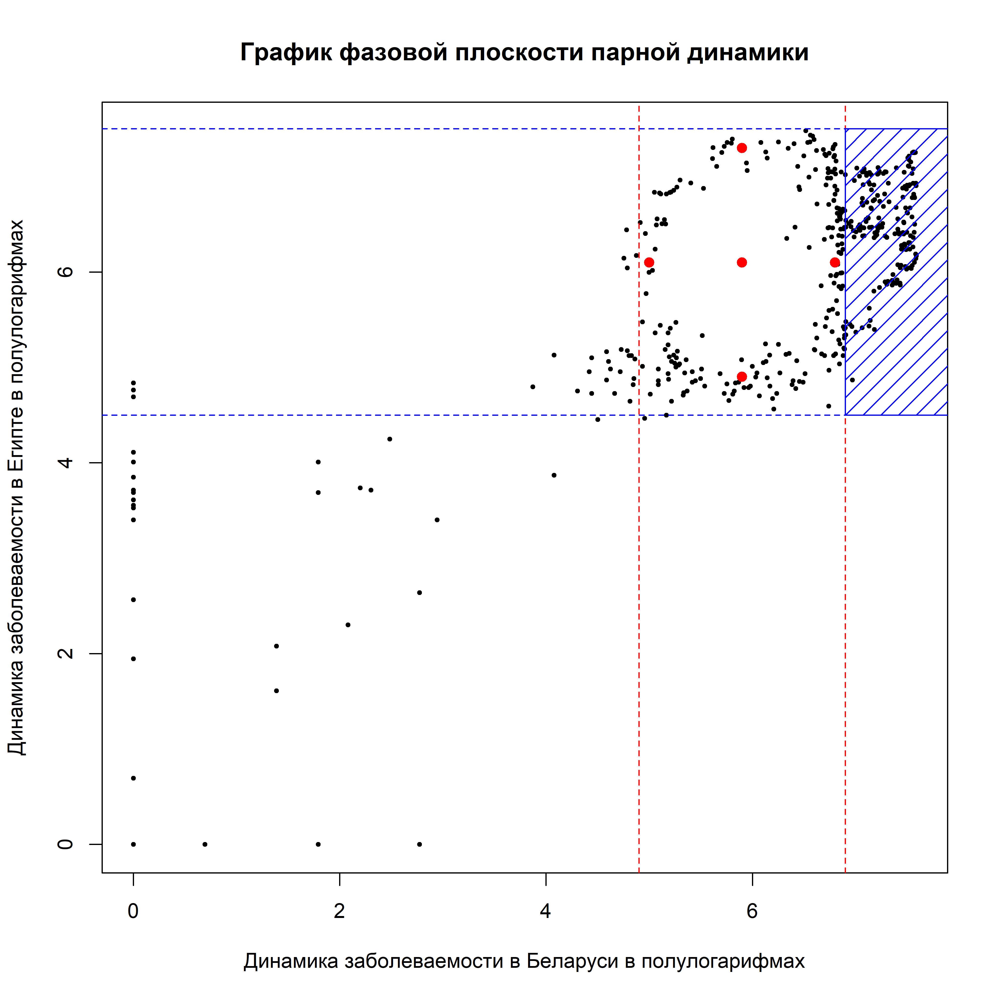
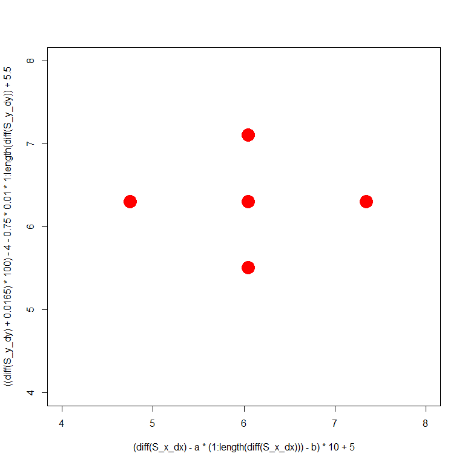
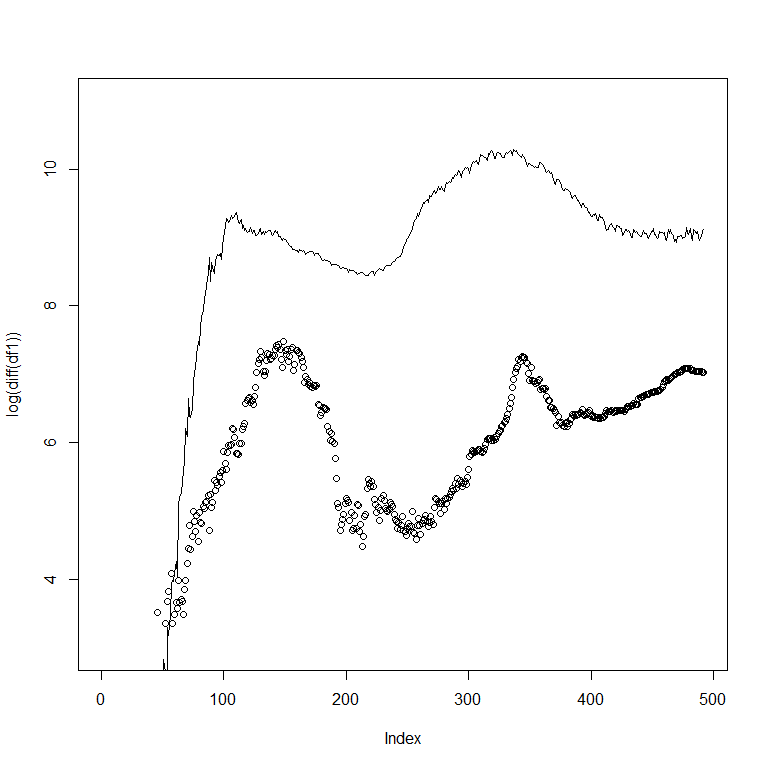
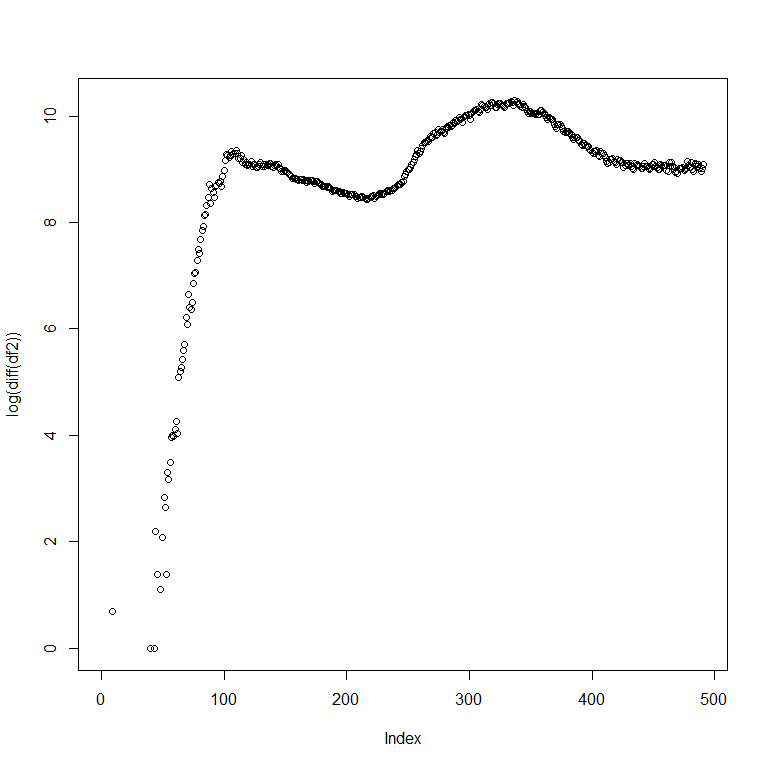

# Анализ парных движений на фазовых плоскостях

## Предобследование парной динамики заболеваемости

Рассмотрим динамику заболеваемости Covid19 в двух странах, построим их графики заболеваемости во времени, а также фазовую плоскость. 

На графике динамики двух стран отложим по оси ординат натуральный логарифм ежедневных приростов больных Covid19, по оси абсцисс номер дня с момента начала мирового распространения 2020-01-22. По данному графику мы сможем визуально оценить модель взаимодействия двух процессов на качественном уровне.

В качестве примера возьмём две страны с открытыми туристическими границами - Египет и Беларусь.


{width=800 height=800}

График парной динамики показывает нам, что уровень заболеваемости, длительность тактов вспышек заболеваемости в двух странах находятся примерно на одном уровне. На последнем временном отрезке в 350 дней от начала измерений и до настоящего времени видим на графике динамики заболеваемости в Беларуси появившуюся недельную сезонность - коррекцию на некоторый момент времени, являющуюся ответной реакцией процесса на некоторые структурные изменения механизма измерения числа заболевших. Такое качественное изменение характера динамики процесса может существенно повлиять на дальнейший анализ данного процесса. 

На графике динамики заболеваемости в Египте видим на момент 28.05.2021 начало спада и точку перелома приростов заболевших Covid19, что означает возможное прохождение точки максимума заражений во время 3 волны массовых заражений.

Оценим длительность тактов переходных процессов спада и роста количества заболевших относительно точек максимума заражений на графике заболеваемости в Египте.

{height=800}

Из расставленных точек максимума заболеваемости на графиках по Беларуси и Египту видим что в начале процесса существовал некоторый почти-периодический процесс с обеих сторон с лагом между процессами в 30 дней. Также видим что из-за структурного изменения процесса измерения числа заболевших в Беларуси такого эффекта не наблюдалось в последнюю волну. 

Для завершения исследования парного развития процесса заболеваемости в двух странах необходимо провести анализ динамики на фазовой плоскости динамик процессов. Произведём построение графика с осью ординат - заболеваемостью в Египте, и осью абсцисс - заболеваемостью в Беларуси:

<!-- -->

На фазовой плоскости динамики двух процессов наблюдаем замкнутый контур завершённого полного такта взаимодействия двух процессов, после которого последовало продолжение огибающего контура в правой части графика. Наблюдаем такую же структурную навивку с отклонениями недельных колебаний в сторону исходной эллипсовой кривой такта взаимодействия двух процессов (выделено синими штрихами).

<!-- -->

<!-- -->

Хорошим тестом для проверки как лага по времени отставания двух процессов друг относительно друга так и зависимости между ними с точки зрения системы дифференциальных уравнений может оказаться смещение на лаг отставания процесса друг относительно друга в сторону постановки "процесса под процесс" так, чтобы такты двух процессов оказались синхронизированными. В таком случае при подобном смещении на графике фазовой плоскости будут образовываться прямолинейные зависимости, обозначающие высокую степень корреляции двух процессов во времени.

<!-- -->

<!-- -->

Таким образом, так же на качественном уровне нами было получено заключение о высокой корреляции процессов после смещения их друг относительно друга на такт запаздывания.

## Постановка системы дифференциальных уравнений процесса взаимодействия

Предположим, что данное взаимодействие двух процессов может быть описано с помощью системы дифференциальных уравнений с логистической зависимостью:

$$
  \frac{dx}{dt} = x \cdot \left(\beta_{1} - \alpha_{1} \cdot y \right)
$$

$$
  \frac{dy}{dt} = y \cdot \left(\beta_{2} - \alpha_{2} \cdot x \right)
$$
Данная система иллюстрирует в своём частном случае при $\beta_{2} < 0$ и $\alpha_{2} < 0$ классическую модель "хищник-жертва".

**Исследование системы первого приближения.** По формуле Тейлора для системы функций, найдем вид системы уравнения в окрестности точки покоя по первому приближению. Вид приближения:

$$
  \frac{dx}{dt} = P(x,y) \approx \frac{\partial P(x_{0}, y_{0})}{\partial x} \cdot (x - x_{0}) + \frac{\partial P(x_{0}, y_{0})}{\partial y} \cdot (y - y_{0})
$$

$$
  \frac{dy}{dt} = Q(x,y) \approx \frac{\partial Q(x_{0}, y_{0})}{\partial x} \cdot (x - x_{0}) + \frac{\partial Q(x_{0}, y_{0})}{\partial y} \cdot (y - y_{0}),
$$
где $P(x, y)$ и $Q(x, y)$ - система функций дифференциальной системы, пара $(x_{0}, y_{0})$ - точка покоя системы дифференциальных уравнений или точка установленного стационарного режима для ассимптотически устойчивых и просто устойчивых систем дифференциальных уравнений.

**Нахождение точки покоя системы дифференциальных уравнений.** Поставим в систему уравнений в левые части нули, обозначающие ноль приращений функций $x(t)$ и $y(t)$ или точку стационарного режима динамической системы:

$$
  0 = x_{0} \cdot \left(\beta_{1} - \alpha_{1} \cdot y_{0} \right)
$$

$$
  0 = y_{0} \cdot \left(\beta_{2} - \alpha_{2} \cdot x_{0} \right).
$$

Тогда решением данной системы $(x_{0}, y_{0})$ будет являться следующая пара значений:

$$
  x_{0} = \frac{\beta_{2}}{\alpha_{2}} 
$$

$$
  y_{0} = \frac{\beta_{1}}{\alpha_{1}} .
$$
Подставим данную пару значений в уравнения системы по первому приближению, получим:

$$
  \frac{dx}{dt} \approx \left(\beta_{1} - \alpha_{1} \cdot y_{0} \right) \cdot (x - x_{0}) - \alpha_{1} \cdot x_{0} \cdot (y - y_{0})
$$

$$
  \frac{dy}{dt} 
  \approx - \alpha_{2} \cdot y_{0} \cdot (x - x_{0}) + \left(\beta_{2} - \alpha_{2} \cdot x_{0} \right) \cdot (y - y_{0})
$$

Тогда в первом приближении система уравнений будет выглядеть следующим образом:

$$
  \frac{dx}{dt} \approx \frac{\beta_{1} \cdot \beta_{2}}{\alpha_{2}} - \alpha_{1} \cdot \frac{\beta_{2}}{\alpha_{2}} \cdot y 
$$

$$
  \frac{dy}{dt} 
  \approx \frac{\beta_{1} \cdot \beta_{2}}{\alpha_{1}} - \alpha_{2} \cdot \frac{\beta_{1}}{\alpha_{1}} \cdot x.
$$
Запишем матрицу $A$ системы уравнений в смещениях $\left( \frac{dX}{dt}, \frac{dY}{dt} \right)$ относительно точки $(0, 0)$, а также определитель данной матрицы:

$$
 A = \begin{pmatrix}
0 &  - \alpha_{1} \cdot \frac{\beta_{2}}{\alpha_{2}}\\
- \alpha_{2} \cdot \frac{\beta_{1}}{\alpha_{1}} & 0
\end{pmatrix}
$$
$$
 det(A) = - (- \alpha_{1} \cdot \frac{\beta_{2}}{\alpha_{2}}) \cdot (- \alpha_{2} \cdot \frac{\beta_{1}}{\alpha_{1}}) = -\beta_{1} \beta_{2}.
$$ 

**Характеристическое уравнение системы первого приближения.** Для системы дифференциальных уравнений в первом приближении запишем характеристическое уравнение для определения характеров возможных точек покоя системы в зависимости от значений параметров системы. Характеристическое уравнение выглядит следующим образом:

$$
  \left| A - \lambda \cdot I  \right| = 0, 
$$

где $A$ - матрица системы уравнений, $\lambda$ - собственные значения матрицы $A$, $I$ - единичная матрица.

Найдем $\lambda$ из данного уравнения:

$$
 \left| A - \lambda \cdot I  \right| = \begin{vmatrix}
-\lambda &  - \alpha_{1} \cdot \frac{\beta_{2}}{\alpha_{2}}\\
- \alpha_{2} \cdot \frac{\beta_{1}}{\alpha_{1}} & -\lambda
\end{vmatrix} = 0
$$

$$
  \lambda^{2} -\beta_{1} \beta_{2} = 0
$$

$$
\lambda_{1, 2} = \pm \sqrt{\beta_{1} \cdot \beta_{2}}.
$$


Из представленного равенства закономерно получаем, что: 

  1. $\lambda_{1, 2} \in \mathbb{R}$ в случае если $(\beta_{1} > 0 \cap \beta_{2} > 0) \cup (\beta_{1} < 0 \cap \beta_{2} < 0)$
  2. $\lambda_{1, 2} \in \mathbb{С}$, если $(\beta_{1} > 0 \cap \beta_{2} < 0) \cup (\beta_{1} < 0 \cap \beta_{2} > 0)$.

В случае, если $\lambda_{1, 2} \in \mathbb{R}$, то $\lambda_{1} > 0$ и $\lambda_{2} < 0$ - точка $(x_0, y_0)$ - седлоузел на графике фазовой плоскости.

В случае, если $\lambda_{1, 2} \in \mathbb{С}$, то $\lambda_{1, 2} = \pm i \cdot \sqrt{ \left| \beta_{1} \right| \cdot \left| \beta_{2} \right|}$ - точка $(x_0, y_0)$ - центр на графике фазовой плоскости.

## Определение параметров дифференциальной модели

Тогда, система анаморфоз для определения параметров данной системы взаимодействия выглядит следующим образом:

$$
  \frac{dx}{x \cdot dt} = \beta_{1} - \alpha_{1} \cdot y
$$

$$
  \frac{dy}{y \cdot dt} = \beta_{2} - \alpha_{2} \cdot x
$$
Алгоритм определения данных параметров выглядит следующим образом: 

  1. построить в спрямляющих функциональных координатах исходные зависимости,
  2. оценить параметры линейных участков данных процессов в спрямляющих координатах,
  3. сохранить параметры линейных моделей.


## Поиск модели системы дифференциального уравнения

Построим графики в спрямляющих координатах для поиска параметров модели взаимодействия двух процессов на основе модели линейной регрессии относительно участков спрямления модели:


<!-- -->


<!-- -->

 
**Модель "красной" линии**

$$
  \frac{dx}{x \cdot dt} = 0.028 + 2.8 * 10^{-5} \cdot y
$$

$$
  \frac{dy}{y \cdot dt} = 0.028 + 2.8 * 10^{-5} \cdot x
$$

**Модель "синей" линии**

$$
  \frac{dx}{x \cdot dt} = 0.0053 + 10^{-6} \cdot y
$$

$$
  \frac{dy}{y \cdot dt} = 0.0053 + 10^{-6} \cdot x
$$

**Модель "сине-зелёной" линии**

$$
  \frac{dx}{x \cdot dt} = 0.0053 + 10^{-6} \cdot y
$$

$$
  \frac{dy}{y \cdot dt} = 0.0091 + 2.8 \cdot 10^{-6} \cdot x
$$

**Модель "красно-зелёной" линии**

$$
  \frac{dx}{x \cdot dt} = 0.028 + 2.8 \cdot 10^{-5} \cdot y
$$

$$
  \frac{dy}{y \cdot dt} = 0.0091 + 2.8 \cdot 10^{-6} \cdot x
$$

В качестве главной модели выберем последнюю (**Модель "красно-зелёной" линии**), по причине того, что она занимает большую часть зависимости. Получим для данной модели системы уравнений качественные кривые и фазовую плоскость. В качестве динамики X и Y выберем исходные данные накопленной заболеваемости в полулогарифмическом масштабе. Полученные оценки модели могут быть применены также к любым другим модельным данным.


{width=1000 height=1000}


{width=1000 height=1000}


<!-- -->


```r
df_model2 <- data.frame(Y = diff(S_y_dy), X = (1:length(diff(S_y_dy))))
model_lm_sy <- lm(Y ~ X, data = df_model2)

df_real2 <- data.frame(Y = log(diff(time_series_Belarus) + 1), 
                      X = (1:length(diff(time_series_Belarus) + 1)))
model_Bel <- lm(Y ~ X, data = df_real2)

plot(((diff(S_y_dy) - model_lm_sy$coefficients[1] - 1:length(diff(S_y_dy)) * model_lm_sy$coefficients[2]) * (105) + 
        model_Bel$coefficients[1] + model_Bel$coefficients[2] * (1:length(diff(time_series_Belarus)))), 
     col = "blue", type =  "o", cex = I(0.5), lwd = I(0.5), pch = 19,
     main = "Сравнение моделируемой динамики процесса и исходной",
     ylab = "Полулогарифм динамики процесса",
     xlab = paste("Дни с", df_confirmed$date[1]),
     ylim = c(2, 8.5))
lines(log(diff(time_series_Belarus)), 
      col = "red", lwd = I(0.5), type = "o", pch = 19, cex = I(0.5))
abline(h = seq(0, 9, 0.5), lwd = I(0.5), lty = 2, col = "grey")
abline(v = seq(0, length(time_series_Belarus) + 10, 25), lwd = I(0.5), lty = 2, col = "grey")
abline(v = maxes_Egypt - tau, col = "orange2")
legend(x = 300, y = 4,
       legend = c("LN приросты Беларусь", "LN приросты модель"),
       col = c("red", "blue"), lty = c(1, 1), pch = c(19, 19))
```

<!-- -->


```r
df1 <- select(df_confirmed, contains("Egypt"))[, ]
df2 <- select(df_confirmed, contains("Russia"))[, ]
```


```r
plot(log(diff(df1)))
```

<!-- -->

```r
plot(log(diff(df2)))
```

<!-- -->

```r
plot(log(diff(df1)), ylim = c(3, 11))
lines(log(diff(df2)))
```

<!-- -->


```r
S_x = cumsum(c(0, log(diff(df1) + 1)))
S_y = cumsum(c(0, log(diff(df2) + 1)))

S_x_dx <- S_x * (beta_X_blue - alpha_X_blue * S_y)
S_y_dy <- S_y * (beta_Y_green - alpha_Y_green * S_x)
```


```r
a <- 0.005
b <- 0

plot((diff(S_x_dx) - a * (1:length(diff(S_x_dx))) - b) * 10 + 5, 
     type = "o",
     pch = 19, 
     lwd = I(0.5),
     cex = I(0.5),
     col = "red",
     ylim = c(1, 9))
lines(((diff(S_y_dy) + 0.0165) * 100) - 4 - 1.3 * 10e-03 * 1:length(diff(S_y_dy)) + 5.5,
      type = "o",
      pch = 19,
      lwd = I(0.5),
      cex = I(0.5),
      col = "blue")
```

<!-- -->

```r
plot(x = (diff(S_x_dx) - a * (1:length(diff(S_x_dx))) - b) * 10 + 5, 
     y = ((diff(S_y_dy) + 0.0165) * 100) - 4 - 1.3 * 10e-03 * 1:length(diff(S_y_dy)) + 5.5,
     xlim = c(1, 5),
     ylim = c(6, 7.5))
```

<!-- -->
