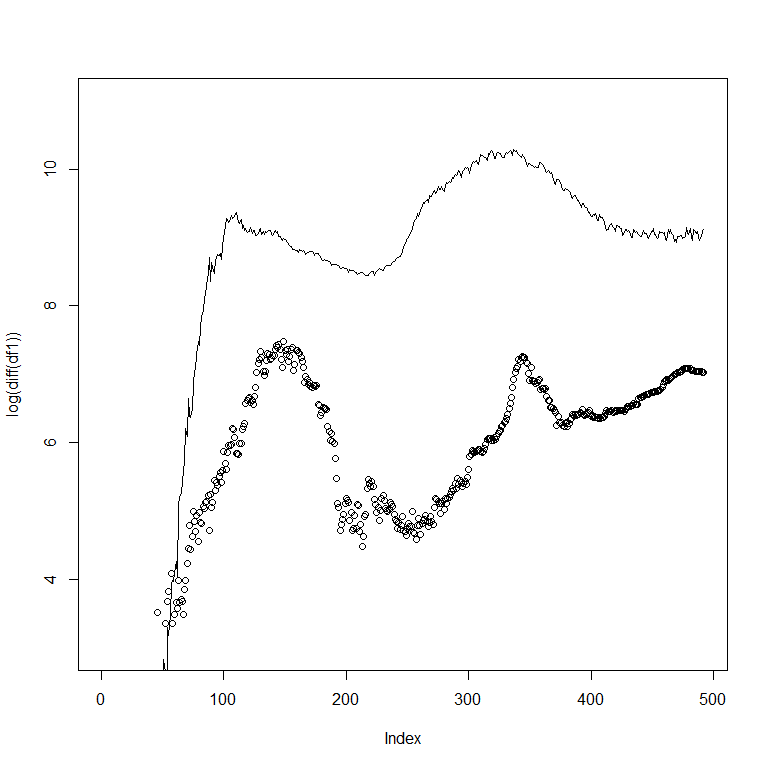
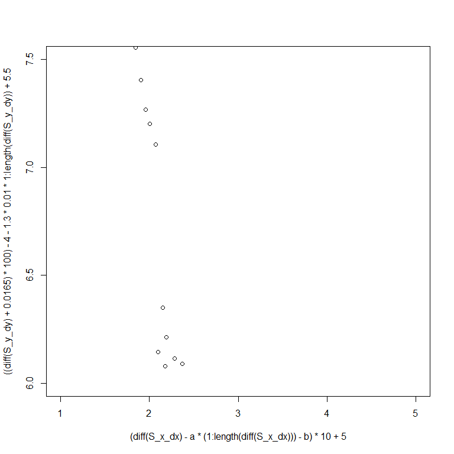

# Анализ парных движений на фазовых плоскостях

## Предобследование парной динамики заболеваемости

Рассмотрим динамику заболеваемости Covid19 в двух странах, построим их графики заболеваемости во времени, а также фазовую плоскость. 

На графике динамики двух стран отложим по оси ординат натуральный логарифм ежедневных приростов больных Covid19, по оси абсцисс номер дня с момента начала мирового распространения 2020-01-22. По данному графику мы сможем визуально оценить модель взаимодействия двух процессов на качественном уровне.

В качестве примера возьмём две страны с открытыми туристическими границами - Египет и Беларусь.


{width=800 height=800}

График парной динамики показывает нам, что уровень заболеваемости, длительность тактов вспышек заболеваемости в двух странах находятся примерно на одном уровне. На последнем временном отрезке в 350 дней от начала измерений и до настоящего времени видим на графике динамики заболеваемости в Беларуси появившуюся недельную сезонность - коррекцию на некоторый момент времени, являющуюся ответной реакцией процесса на некоторые структурные изменения механизма измерения числа заболевших. Такое качественное изменение характера динамики процесса может существенно повлиять на дальнейший анализ данного процесса. 

На графике динамики заболеваемости в Египте видим на момент 28.05.2021 начало спада и точку перелома приростов заболевших Covid19, что означает возможное прохождение точки максимума заражений во время 3 волны массовых заражений.

Оценим длительность тактов переходных процессов спада и роста количества заболевших относительно точек максимума заражений на графике заболеваемости в Египте.

{height=800}

Из расставленных точек максимума заболеваемости на графиках по Беларуси и Египту видим что в начале процесса существовал некоторый почти-периодический процесс с обеих сторон с лагом между процессами в 30 дней. Также видим что из-за структурного изменения процесса измерения числа заболевших в Беларуси такого эффекта не наблюдалось в последнюю волну. 

Для завершения исследования парного развития процесса заболеваемости в двух странах необходимо провести анализ динамики на фазовой плоскости динамик процессов. Произведём построение графика с осью ординат - заболеваемостью в Египте, и осью абсцисс - заболеваемостью в Беларуси:

<!-- -->

На фазовой плоскости динамики двух процессов наблюдаем замкнутый контур завершённого полного такта взаимодействия двух процессов, после которого последовало продолжение огибающего контура в правой части графика. Наблюдаем такую же структурную навивку с отклонениями недельных колебаний в сторону исходной эллипсовой кривой такта взаимодействия двух процессов (выделено синими штрихами).

## Постановка системы дифференциальных уравнений процесса взаимодействия

Предположим, что данное взаимодействие двух процессов может быть описано с помощью системы дифференциальных уравнений с логистической зависимостью:

$$
  \frac{dx}{dt} = x \cdot \left(\beta_{1} - \alpha_{1} \cdot y \right)
$$

$$
  \frac{dy}{dt} = y \cdot \left(\beta_{2} - \alpha_{2} \cdot x \right)
$$
Данная система иллюстрирует в своём частном случае при $\beta_{2} < 0$ и $\alpha_{2} < 0$ классическую модель "хищник-жертва".

Тогда, система анаморфоз для определения параметров данной системы взаимодействия выглядит следующим образом:

$$
  \frac{dx}{x \cdot dt} = \beta_{1} - \alpha_{1} \cdot y
$$

$$
  \frac{dy}{y \cdot dt} = \beta_{2} - \alpha_{2} \cdot x
$$
Алгоритм определения данных параметров выглядит следующим образом: 

  1. построить в спрямляющих функциональных координатах исходные зависимости,
  2. оценить параметры линейных участков данных процессов в спрямляющих координатах,
  3. сохранить параметры линейных моделей.


<!-- -->

<!-- -->

Хорошим тестом для проверки как лага по времени отставания двух процессов друг относительно друга так и зависимости между ними с точки зрения системы дифференциальных уравнений можем оказаться смещение на лаг отставания процесса друг относительно друга в сторону постановки "процесса под процесс" так, чтобы такты двух процессов оказались синхронизированными. В таком случае при подобном смещении на графике фазовой плоскости будут образовываться прямолинейные зависимости, обозначающие высокую степень корреляции двух процессов во времени.

<!-- -->

<!-- -->

Таким образом, так же на качественном уровне нами было получено заключение о высокой корреляции процессов после смещения их друг относительно друга на такт запаздывания.

## Поиск модели системы дифференциального уравнения

Построим графики в спрямляющих координатах для поиска параметров модели взаимодействия двух процессов на основе модели линейной регрессии относительно участков спрямления модели:


<!-- -->


<!-- -->


### Модель "красной" линии

$$
  \frac{dx}{x \cdot dt} = 0.028 + 2.8 * 10^{-5} \cdot y
$$

$$
  \frac{dy}{y \cdot dt} = 0.028 + 2.8 * 10^{-5} \cdot x
$$

### Модель "синей" линии

$$
  \frac{dx}{x \cdot dt} = 0.0053 + 10^{-6} \cdot y
$$

$$
  \frac{dy}{y \cdot dt} = 0.0053 + 10^{-6} \cdot x
$$

### Модель "сине-зелёной" линии

$$
  \frac{dx}{x \cdot dt} = 0.0053 + 10^{-6} \cdot y
$$

$$
  \frac{dy}{y \cdot dt} = 0.0091 + 2.8 \cdot 10^{-6} \cdot x
$$

### Модель "красно-зелёной" линии

$$
  \frac{dx}{x \cdot dt} = 0.028 + 2.8 \cdot 10^{-5} \cdot y
$$

$$
  \frac{dy}{y \cdot dt} = 0.0091 + 2.8 \cdot 10^{-6} \cdot x
$$


```r
df_model <- data.frame(Y = diff(S_x_dx), X = (1:length(diff(S_x_dx))))
model_lm_sx <- lm(Y ~ X, data = df_model)

df_real <- data.frame(Y = log(diff(time_series_Egypt) + 1), 
                      X = (1:length(diff(time_series_Egypt) + 1)))
model_Egypt <- lm(Y ~ X, data = df_real)

plot(((diff(S_x_dx) - model_lm_sx$coefficients[1] - 1:length(diff(S_x_dx)) * model_lm_sx$coefficients[2]) * 165 + 
        model_Egypt$coefficients[1] + model_Egypt$coefficients[2] * (1:length(diff(time_series_Egypt)))), 
     col = "blue", type =  "o", cex = I(0.5), lwd = I(0.5), pch = 19,
     main = "Сравнение моделируемой динамики процесса и исходной",
     ylab = "Полулогарифм динамики процесса",
     xlab = paste("Дни с", df_confirmed$date[1]))
lines(log(diff(time_series_Egypt)), 
      col = "red", lwd = I(0.5), type = "o", pch = 19, cex = I(0.5))
```

<!-- -->


```r
plot(x = 1:length(time_series_Egypt), y = c(0, log(diff(time_series_Egypt) + 1)), 
     col = "red", 
     main = "Заболеваемость в Беларуси, реальная и моделируемая",
     pch = 19,
     type = "o",
     lwd = I(0.5), 
     cex = I(0.5), 
     ylim = c(0, 10),
     ylab = "Полулогарифм заболеваемости каждый день",
     xlab = "Даты с ")
lines((diff(S_x_dx)), 
      col = "blue", 
      type = "o", 
      pch = 19,
      cex = I(0.5),
      lwd = I(0.5))
legend(x = 0, y = 10, 
       legend = c("Реальная заболеваемость", "Моделируемая заболеваемость"), 
       col = c("red", "blue"), 
       lty = c(1, 1), 
       pch = c(19, 19))
```

<!-- -->


```r
a <- 0.0035
b <- 0
plot((diff(S_x_dx) - a * (1:length(diff(S_x_dx))) - b) * 10 + 5, type = "l", col = "blue")
lines(log(diff(df1) + 1), col = "red")
```

<!-- -->


```r
plot(x = 1:length(df2), y = c(0, log(diff(df2) + 1)), 
     col = "red", 
     main = "Заболеваемость в Беларуси, реальная и моделируемая",
     pch = 19,
     type = "o",
     lwd = I(0.5), 
     cex = I(0.5), 
     ylim = c(3.5, 9),
     ylab = "Полулогарифм заболеваемости каждый день",
     xlab = "Даты с ")
lines((diff(S_y_dy) + 0.0165) * 100, 
      col = "blue", 
      type = "o", 
      pch = 19,
      cex = I(0.5),
      lwd = I(0.5))
legend(x = 0, y = 9, 
       legend = c("Реальная заболеваемость", "Моделируемая заболеваемость"), 
       col = c("red", "blue"), 
       lty = c(1, 1), 
       pch = c(19, 19))
```

<!-- -->


```r
plot(x = 1:length(df2), y = c(0, log(diff(df2) + 1)), 
     col = "red", 
     main = "Заболеваемость в Беларуси, реальная и моделируемая",
     pch = 19,
     type = "o",
     lwd = I(0.5), 
     cex = I(0.5), 
     ylim = c(3.5, 9),
     ylab = "Полулогарифм заболеваемости каждый день",
     xlab = "Даты с ")
lines(((diff(S_y_dy) + 0.0165) * 100) - 4 - 0.75 * 10e-03 * 1:length(diff(S_y_dy)) + 5.5, 
      col = "blue", 
      type = "o", 
      pch = 19,
      cex = I(0.5),
      lwd = I(0.5))
legend(x = 0, y = 9, 
       legend = c("Реальная заболеваемость", "Моделируемая заболеваемость"), 
       col = c("red", "blue"), 
       lty = c(1, 1), 
       pch = c(19, 19))
```

<!-- -->


```r
plot((diff(S_x_dx) - a * (1:length(diff(S_x_dx))) - b) * 10 + 5, 
     type = "o",
     pch = 19, 
     lwd = I(0.5),
     cex = I(0.5),
     col = "red",
     ylim = c(4, 8))
lines(((diff(S_y_dy) + 0.0165) * 100) - 4 - 0.75 * 10e-03 * 1:length(diff(S_y_dy)) + 5.5,
      type = "o",
      pch = 19,
      lwd = I(0.5),
      cex = I(0.5),
      col = "blue")
```

<!-- -->

```r
plot(x = (diff(S_x_dx) - a * (1:length(diff(S_x_dx))) - b) * 10 + 5, 
     y = ((diff(S_y_dy) + 0.0165) * 100) - 4 - 0.75 * 10e-03 * 1:length(diff(S_y_dy)) + 5.5,
     xlim = c(4, 8),
     ylim = c(4, 8))
radius_a = 1.3
radius_b = 0.8
center_x = 6.15
center_y = 6.3
points(x = c(center_x - radius_a, center_x, center_x + radius_a, center_x, center_x) - 0.1, 
       y = c(center_y, center_y, center_y, center_y + radius_b, center_y - radius_b), pch = 19, cex = I(3), col = "red")
```

<!-- -->


```r
df1 <- select(df_confirmed, contains("Egypt"))[, ]
df2 <- select(df_confirmed, contains("Russia"))[, ]
```


```r
plot(log(diff(df1)))
```

<!-- -->

```r
plot(log(diff(df2)))
```

<!-- -->

```r
plot(log(diff(df1)), ylim = c(3, 11))
lines(log(diff(df2)))
```

<!-- -->


```r
S_x = cumsum(c(0, log(diff(df1) + 1)))
S_y = cumsum(c(0, log(diff(df2) + 1)))

S_x_dx <- S_x * (beta_X_blue - alpha_X_blue * S_y)
S_y_dy <- S_y * (beta_Y_green - alpha_Y_green * S_x)
```


```r
a <- 0.005
b <- 0

plot((diff(S_x_dx) - a * (1:length(diff(S_x_dx))) - b) * 10 + 5, 
     type = "o",
     pch = 19, 
     lwd = I(0.5),
     cex = I(0.5),
     col = "red",
     ylim = c(1, 9))
lines(((diff(S_y_dy) + 0.0165) * 100) - 4 - 1.3 * 10e-03 * 1:length(diff(S_y_dy)) + 5.5,
      type = "o",
      pch = 19,
      lwd = I(0.5),
      cex = I(0.5),
      col = "blue")
```

<!-- -->

```r
plot(x = (diff(S_x_dx) - a * (1:length(diff(S_x_dx))) - b) * 10 + 5, 
     y = ((diff(S_y_dy) + 0.0165) * 100) - 4 - 1.3 * 10e-03 * 1:length(diff(S_y_dy)) + 5.5,
     xlim = c(1, 5),
     ylim = c(6, 7.5))
```

<!-- -->
