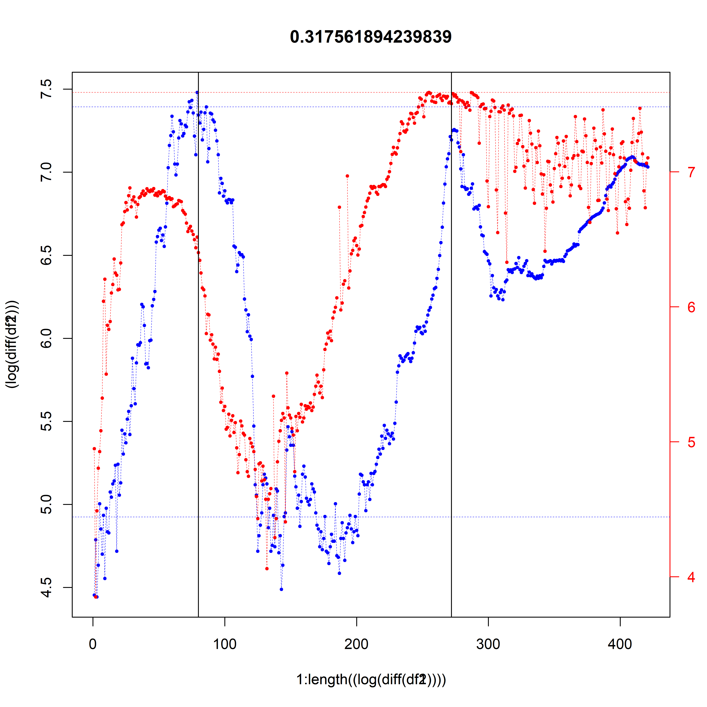
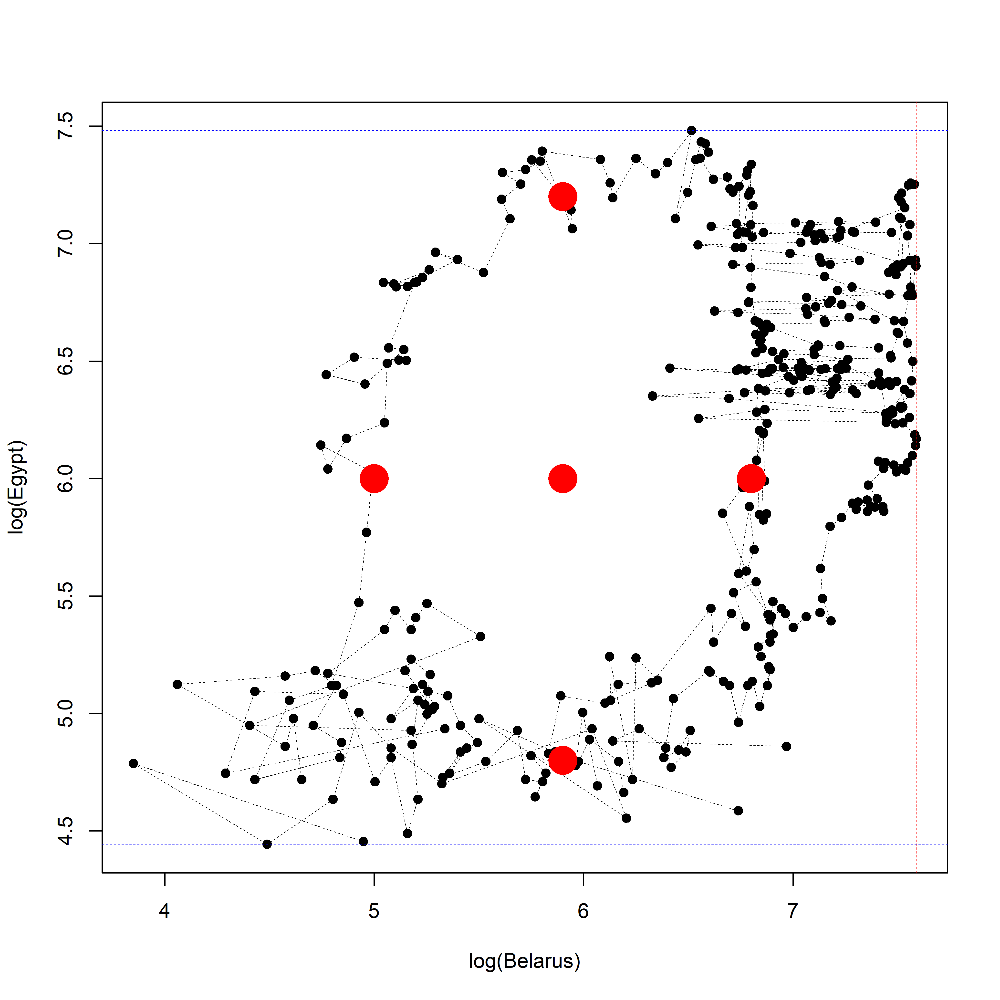
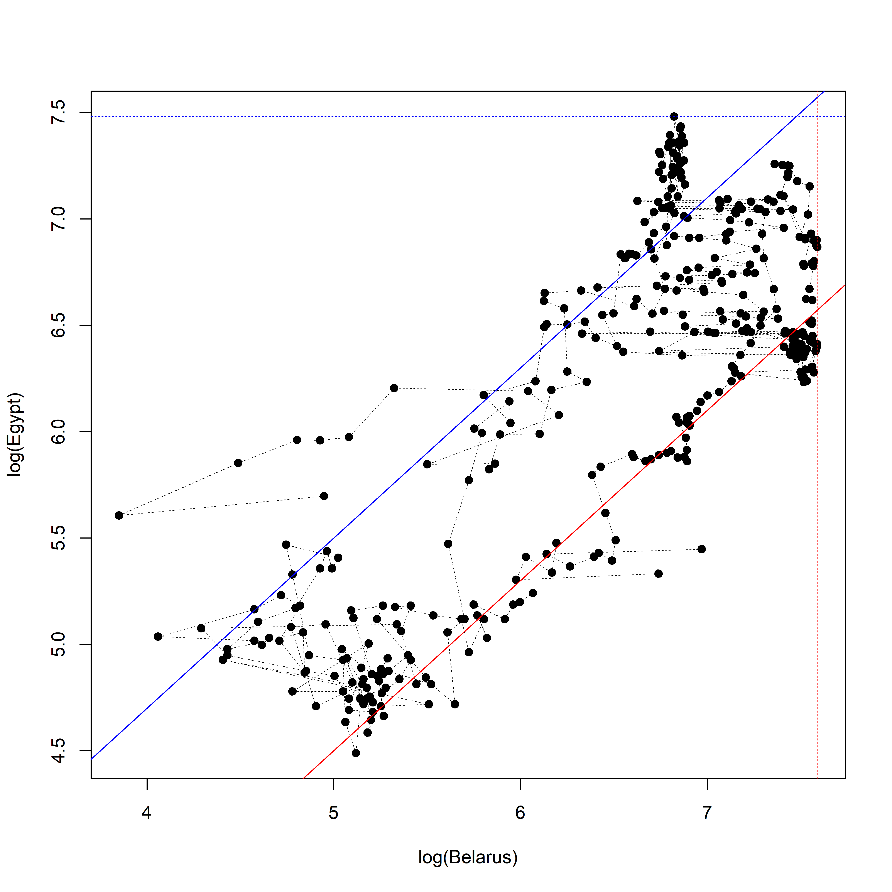

```
## Registered S3 methods overwritten by 'tibble':
##   method     from  
##   format.tbl pillar
##   print.tbl  pillar
```

```
## 
## Attaching package: 'dplyr'
```

```
## The following objects are masked from 'package:stats':
## 
##     filter, lag
```

```
## The following objects are masked from 'package:base':
## 
##     intersect, setdiff, setequal, union
```

```
## 
## Confid data downloaded!
```

```
## 
## Deaths data downloaded
```

```
## 
## Recovered data downloaded
```

```
## Registered S3 method overwritten by 'quantmod':
##   method            from
##   as.zoo.data.frame zoo
```

{width=800 height=800}{width=800 height=800}


```
## Warning in plot.xy(xy.coords(x, y), type = type, ...): "axes" -- не графический
## параметр
```

{width=800 height=800}{width=800 height=800}
